# 🤖 GenAI RAG Boilerplate with LangChain & Milvus

A production-ready **Retrieval-Augmented Generation (RAG)** boilerplate built with **FastAPI**, **LangChain**, and **Milvus** vector database. This project provides a complete foundation for building AI-powered document search and question-answering systems.

## ✨ Key Features

### 🔍 **Advanced RAG Pipeline**
- **Document Processing** with LangChain loaders (PDF, DOCX, TXT, MD, CSV)
- **Intelligent Chunking** with customizable overlap and size
- **Vector Embeddings** using Sentence Transformers
- **Semantic Search** with similarity scoring
- **Context-Aware Q&A** with multiple AI providers

### 🗄️ **Milvus Vector Database**
- **High-Performance** vector similarity search
- **Scalable Storage** with automatic indexing
- **Collection Management** with schema validation
- **Real-time Operations** with CRUD operations
- **Production Ready** with clustering support

### 🚀 **FastAPI Backend**
- **REST API** with OpenAPI documentation
- **Async Operations** for high performance
- **Error Handling** with structured responses
- **File Upload** with validation and processing
- **Health Checks** and monitoring endpoints

### 🤖 **Multi-AI Provider Support**
- **OpenAI** (GPT-3.5, GPT-4, GPT-4 Turbo)
- **Anthropic** (Claude 3 Series)
- **Google** (Gemini Models)
- **Extensible** for custom providers

# 🏗️ Architecture Documentation

## 🌐 High-Level Design (HLD)

### System Overview
The GenAI RAG Boilerplate is designed as a **microservices-based, AI-powered document processing and retrieval system** that provides intelligent question-answering capabilities through Retrieval-Augmented Generation (RAG).

### Core Architectural Principles
- **Microservices Architecture**: Loosely coupled services with clear boundaries
- **Event-Driven Processing**: Asynchronous document processing and vector operations
- **API-First Design**: RESTful APIs with comprehensive OpenAPI documentation
- **Vector-Native**: Built around high-performance vector similarity search
- **AI-Agnostic**: Pluggable AI provider architecture
- **Container-Ready**: Docker-first deployment with orchestration support

### System Architecture Diagram

```mermaid
graph TB
    subgraph "Client Layer"
        CLI["🖥️ CLI Tools\n• cURL\n• Python SDK\n• API Testing"]
        WEB["🌐 Web Interface\n• Swagger UI\n• Custom Frontend\n• Admin Dashboard"]
        SDK["📦 SDK/Libraries\n• Python Client\n• REST Client\n• WebSocket Client"]
    end
    
    subgraph "API Gateway Layer"
        LB["⚖️ Load Balancer\n• Nginx/HAProxy\n• SSL Termination\n• Rate Limiting"]
    end
    
    subgraph "Application Layer"
        API["🚀 FastAPI Backend\n• REST Endpoints\n• Request Validation\n• Error Handling\n• Authentication"]
        
        subgraph "Business Logic"
            RAG["🧠 RAG Service\n• Document Processing\n• LangChain Integration\n• Q&A Generation"]
            EMBED["🔢 Embedding Service\n• Text Vectorization\n• Model Management\n• Batch Processing"]
            DOC["📄 Document Service\n• File Processing\n• Text Extraction\n• Metadata Management"]
        end
    end
    
    subgraph "Data Layer"
        MILVUS[("🗄️ Milvus VectorDB\n• Vector Storage\n• Similarity Search\n• Index Management\n• Collection Schema")]
        MINIO[("📦 MinIO Storage\n• Object Storage\n• File Persistence\n• Backup & Recovery")]
        ETCD[("🔧 etcd\n• Metadata Store\n• Configuration\n• Service Discovery")]
    end
    
    subgraph "External Services"
        OPENAI["🤖 OpenAI\n• GPT Models\n• Text Generation\n• Embeddings"]
        ANTHROPIC["🎭 Anthropic\n• Claude Models\n• Text Analysis"]
        GOOGLE["🔍 Google AI\n• Gemini Models\n• Language Processing"]
        CUSTOM["⚙️ Custom LLMs\n• Local Models\n• Private APIs"]
    end
    
    subgraph "Infrastructure"
        DOCKER["🐳 Docker\n• Containerization\n• Service Isolation"]
        K8S["☸️ Kubernetes\n• Orchestration\n• Scaling\n• Health Checks"]
        MONITOR["📊 Monitoring\n• Prometheus\n• Grafana\n• Logging"]
    end
    
    CLI --> LB
    WEB --> LB
    SDK --> LB
    LB --> API
    
    API --> RAG
    API --> EMBED
    API --> DOC
    
    RAG --> MILVUS
    RAG --> OPENAI
    RAG --> ANTHROPIC
    RAG --> GOOGLE
    RAG --> CUSTOM
    
    EMBED --> MILVUS
    DOC --> MINIO
    
    MILVUS --> ETCD
    MILVUS --> MINIO
    
    API -.-> MONITOR
    MILVUS -.-> MONITOR
    
    DOCKER -.-> API
    DOCKER -.-> MILVUS
    DOCKER -.-> MINIO
    DOCKER -.-> ETCD
    
    K8S -.-> DOCKER
```


### Component Responsibilities

| Component | Responsibility | Technology |
|-----------|---------------|-----------|
| **FastAPI Backend** | API routing, validation, error handling | FastAPI, Pydantic, Uvicorn |
| **RAG Service** | Document processing, LangChain integration | LangChain, Custom Retrievers |
| **Milvus VectorDB** | Vector storage, similarity search, indexing | Milvus, FAISS, GPU acceleration |
| **MinIO Storage** | Object storage, file persistence, backups | MinIO S3-compatible storage |
| **AI Providers** | Text generation, embeddings, language models | OpenAI, Anthropic, Google AI |

## 🔧 Low-Level Design (LLD)

### Backend Service Architecture

```mermaid
graph TD
    subgraph "FastAPI Application"
        MAIN["📱 main.py\n• App initialization\n• Middleware setup\n• Exception handlers"]
        
        subgraph "API Layer"
            ROUTES["🛣️ endpoints.py\n• Route definitions\n• Request handling\n• Response formatting"]
            MODELS["📋 api_models.py\n• Pydantic models\n• Request validation\n• Response schemas"]
        end
        
        subgraph "Business Logic Layer"
            RAG_SVC["🧠 rag_service.py\n• Document processing\n• LangChain chains\n• Q&A generation"]
            
            subgraph "Core Services"
                MILVUS_CLIENT["🗄️ milvus_client.py\n• Vector operations\n• Collection management\n• Search algorithms"]
                EMBED_SVC["🔢 Embedding Service\n• Text vectorization\n• Model management"]
                DOC_SVC["📄 Document Service\n• File processing\n• Text extraction"]
            end
        end
        
        subgraph "Configuration Layer"
            SETTINGS["⚙️ settings.py\n• Environment config\n• Pydantic settings\n• Validation rules"]
            ENV["📝 .env\n• API keys\n• Database URLs\n• Feature flags"]
        end
    end
    
    subgraph "External Dependencies"
        LANGCHAIN["🔗 LangChain\n• Document loaders\n• Text splitters\n• Retrievers"]
        SENTENCE_T["🎯 SentenceTransformers\n• Embedding models\n• Vector generation"]
        PYMILVUS["🐍 PyMilvus\n• Database client\n• Vector operations"]
    end
    
    MAIN --> ROUTES
    MAIN --> SETTINGS
    ROUTES --> MODELS
    ROUTES --> RAG_SVC
    
    RAG_SVC --> MILVUS_CLIENT
    RAG_SVC --> EMBED_SVC
    RAG_SVC --> DOC_SVC
    
    RAG_SVC --> LANGCHAIN
    EMBED_SVC --> SENTENCE_T
    MILVUS_CLIENT --> PYMILVUS
    
    SETTINGS --> ENV
```



### Request Processing Flow


### Class Architecture


## 🗄️ Data Architecture

### Milvus Collection Schema


### Vector Index Strategy

```mermaid
graph LR
    subgraph "Indexing Pipeline"
        TEXT["📄 Text Input\n• Document content\n• Query strings\n• Metadata"]
        EMBED["🔢 Embedding Model\n• SentenceTransformers\n• 384 dimensions\n• Normalization"]
        VECTOR["📊 Vector\n• Float array\n• L2 normalized\n• 384-dim"]
    end
    
    subgraph "Index Types"
        IVF["🏗️ IVF_FLAT\n• Inverted File Index\n• nlist = 128\n• Fast search"]
        HNSW["🕸️ HNSW\n• Hierarchical NSW\n• M = 16\n• High accuracy"]
        FLAT["📏 FLAT\n• Brute force\n• 100% accuracy\n• Small datasets"]
    end
    
    subgraph "Search Strategy"
        QUERY["🔍 Query Vector"]
        SEARCH["⚡ ANN Search\n• nprobe = 10\n• Top-K results\n• Distance metric"]
        RESULTS["📋 Results\n• Similarity scores\n• Document chunks\n• Metadata"]
    end
    
    TEXT --> EMBED
    EMBED --> VECTOR
    VECTOR --> IVF
    VECTOR --> HNSW
    VECTOR --> FLAT
    
    QUERY --> SEARCH
    IVF --> SEARCH
    HNSW --> SEARCH
    FLAT --> SEARCH
    SEARCH --> RESULTS
```



### Data Flow Architecture

```mermaid
flowchart TB
    subgraph "Data Ingestion"
        UPLOAD["📤 File Upload\n• PDF, DOCX, TXT\n• Size validation\n• Type checking"]
        EXTRACT["📜 Text Extraction\n• PyPDF2\n• python-docx\n• BeautifulSoup"]
        CHUNK["✂️ Text Chunking\n• RecursiveCharacterTextSplitter\n• 1000 char chunks\n• 200 char overlap"]
    end
    
    subgraph "Vector Processing"
        EMBED["🔢 Embedding Generation\n• SentenceTransformers\n• Batch processing\n• Normalization"]
        STORE["💾 Vector Storage\n• Milvus collection\n• Metadata indexing\n• Automatic flushing"]
    end
    
    subgraph "Query Processing"
        QUERY["❓ User Query\n• Natural language\n• Intent extraction"]
        SEARCH["🔍 Similarity Search\n• Vector comparison\n• Top-K retrieval\n• Score filtering"]
        CONTEXT["📚 Context Assembly\n• Relevant chunks\n• Metadata enrichment\n• Ranking"]
    end
    
    subgraph "Response Generation"
        PROMPT["📝 Prompt Engineering\n• System instructions\n• Context injection\n• Query formatting"]
        LLM["🤖 Language Model\n• OpenAI GPT\n• Anthropic Claude\n• Google Gemini"]
        RESPONSE["💬 Structured Response\n• Answer text\n• Source references\n• Confidence scores"]
    end
    
    subgraph "Storage Layer"
        MILVUS_DB[("🗄️ Milvus\n• Vector collections\n• Index management\n• Query processing")]
        MINIO_DB[("📦 MinIO\n• Original files\n• Processed documents\n• Backup storage")]
        ETCD_DB[("⚙️ etcd\n• Metadata\n• Configuration\n• Service state")]
    end
    
    UPLOAD --> EXTRACT
    EXTRACT --> CHUNK
    CHUNK --> EMBED
    EMBED --> STORE
    STORE --> MILVUS_DB
    
    QUERY --> SEARCH
    SEARCH --> MILVUS_DB
    MILVUS_DB --> CONTEXT
    CONTEXT --> PROMPT
    PROMPT --> LLM
    LLM --> RESPONSE
    
    STORE --> MINIO_DB
    MILVUS_DB --> ETCD_DB
```



### Performance Optimization Strategy

```mermaid
graph TB
    subgraph "Query Optimization"
        CACHE["🚀 Response Caching\n• Redis integration\n• Query fingerprinting\n• TTL management"]
        BATCH["📦 Batch Processing\n• Multiple queries\n• Embedding batching\n• Connection pooling"]
        FILTER["🎯 Early Filtering\n• Metadata filters\n• Score thresholds\n• Result limiting"]
    end
    
    subgraph "Index Optimization"
        TUNE["⚙️ Index Tuning\n• nlist optimization\n• nprobe adjustment\n• Memory allocation"]
        PART["📂 Collection Partitioning\n• Time-based splits\n• Category grouping\n• Load balancing"]
        COMP["🗜️ Vector Compression\n• Quantization\n• Dimensionality reduction\n• Storage optimization"]
    end
    
    subgraph "System Optimization"
        SCALE["📈 Horizontal Scaling\n• Multiple Milvus nodes\n• API replicas\n• Load distribution"]
        MONITOR["📊 Performance Monitoring\n• Query latency\n• Throughput metrics\n• Resource utilization"]
        AUTO["🔄 Auto-scaling\n• CPU-based scaling\n• Memory thresholds\n• Queue length triggers"]
    end
    
    CACHE -.-> TUNE
    BATCH -.-> PART
    FILTER -.-> COMP
    
    TUNE --> SCALE
    PART --> MONITOR
    COMP --> AUTO
```



## 🚀 Quick Start

### Prerequisites

- **Python 3.10+**
- **Docker & Docker Compose**
- **Git**

### 1. Clone & Setup

```bash
git clone https://github.com/yourusername/genai-boilerplate-milvus-python.git
cd genai-boilerplate-milvus-python
```

### 2. Environment Configuration

```bash
# Copy environment template
cp backend/.env.example backend/.env

# Edit configuration (add your API keys)
nano backend/.env
```

**Required Configuration:**
```bash
# Security
SECRET_KEY="your-super-secret-key-change-in-production"

# AI Provider (at least one)
OPENAI_API_KEY="sk-your-openai-key"
# ANTHROPIC_API_KEY="claude-your-key"
# GOOGLE_API_KEY="your-google-key"

# Milvus (defaults work with Docker)
MILVUS_HOST="localhost"
MILVUS_PORT=19530
MILVUS_COLLECTION_NAME="documents"

# Embedding Settings
EMBEDDING_MODEL="sentence-transformers/all-MiniLM-L6-v2"
EMBEDDING_DIMENSION=384
CHUNK_SIZE=1000
CHUNK_OVERLAP=200
```

### 3. Docker Deployment

```bash
# Start all services (Milvus + API)
docker-compose up --build -d

# Check service status
docker-compose ps
```

**Services Started:**
- **Milvus Standalone**: `http://localhost:19530` (Vector Database)
- **RAG API**: `http://localhost:8000` (FastAPI Backend)
- **Milvus Admin (Attu)**: `http://localhost:3001` (Optional Web UI)
- **MinIO**: `http://localhost:9001` (Object Storage)

### 4. Verify Installation

```bash
# Health check
curl http://localhost:8000/api/v1/health

# API documentation
open http://localhost:8000/docs
```

### 5. Run Example

```bash
# Install dependencies locally (for examples)
cd backend
pip install -r requirements.txt

# Run the comprehensive example
python examples/rag_example.py

# Test all API endpoints
python examples/api_test.py
```

## 📚 API Documentation

### 🏥 Health & Config

```bash
GET  /api/v1/health          # Service health check
GET  /api/v1/config          # Current configuration
```

### 📄 Document Management

```bash
POST /api/v1/documents/upload         # Upload & process document
GET  /api/v1/documents/stats          # Collection statistics
DELETE /api/v1/documents/{id}         # Delete document
```

### 🔍 Search & RAG

```bash
POST /api/v1/documents/search         # Semantic search
POST /api/v1/chat/completions         # RAG question answering
```

### Example Requests

#### Document Upload
```bash
curl -X POST "http://localhost:8000/api/v1/documents/upload" \
  -H "Content-Type: multipart/form-data" \
  -F "file=@your-document.pdf"
```

#### Document Search
```bash
curl -X POST "http://localhost:8000/api/v1/documents/search" \
  -H "Content-Type: application/json" \
  -d '{
    "query": "What are the main benefits of AI?",
    "top_k": 5,
    "score_threshold": 0.1
  }'
```

#### Question Answering
```bash
curl -X POST "http://localhost:8000/api/v1/chat/completions" \
  -H "Content-Type: application/json" \
  -d '{
    "question": "How does machine learning work?",
    "top_k": 3,
    "ai_provider": "openai",
    "ai_model": "gpt-3.5-turbo"
  }'
```

## 🔧 Development Setup

### Local Development

```bash
# Backend setup
cd backend
python -m venv venv
source venv/bin/activate  # On Windows: venv\Scripts\activate
pip install -r requirements.txt

# Start Milvus only
docker-compose up milvus etcd minio -d

# Run API locally
python src/main.py
```

### Environment Variables

| Variable | Description | Default |
|----------|-------------|---------|
| `SECRET_KEY` | JWT secret key | Required |
| `MILVUS_HOST` | Milvus server host | `localhost` |
| `MILVUS_PORT` | Milvus server port | `19530` |
| `MILVUS_COLLECTION_NAME` | Collection name | `documents` |
| `EMBEDDING_MODEL` | Sentence transformer model | `all-MiniLM-L6-v2` |
| `EMBEDDING_DIMENSION` | Embedding vector size | `384` |
| `CHUNK_SIZE` | Text chunk size | `1000` |
| `CHUNK_OVERLAP` | Chunk overlap size | `200` |
| `OPENAI_API_KEY` | OpenAI API key | Optional |
| `ANTHROPIC_API_KEY` | Anthropic API key | Optional |
| `GOOGLE_API_KEY` | Google AI API key | Optional |

## 📖 Usage Examples

### Python SDK Usage

```python
import asyncio
from backend.src.services.rag_service import rag_service
from backend.src.core.milvus_client import milvus_client

async def example():
    # Connect to Milvus
    await milvus_client.connect()
    
    # Process a document
    document_id = await rag_service.process_and_store_document(
        file_path="example.pdf",
        metadata={"title": "Example Document"}
    )
    
    # Search for similar content
    results = await rag_service.search_documents(
        query="What is artificial intelligence?",
        top_k=5
    )
    
    # Answer questions using RAG
    response = await rag_service.answer_question(
        question="How does AI work?",
        ai_provider="openai",
        ai_model="gpt-3.5-turbo"
    )
    
    print(f"Answer: {response['answer']}")
    
    # Cleanup
    await milvus_client.disconnect()

# Run example
asyncio.run(example())
```

### Custom LangChain Integration

```python
from backend.src.services.rag_service import rag_service

# Create custom retrieval chain
chain = await rag_service.create_custom_chain(
    chain_type="retrieval_qa",
    ai_provider="openai",
    ai_model="gpt-4"
)

# Use the chain
result = chain({"query": "What are the benefits of RAG?"})
print(result["result"])
```

### Direct Milvus Operations

```python
from backend.src.core.milvus_client import milvus_client

# Connect
await milvus_client.connect()

# Insert documents
documents = [
    {
        "document_id": "doc1",
        "chunk_index": 0,
        "text": "This is example text",
        "metadata": {"source": "example.txt"}
    }
]
chunk_ids = await milvus_client.insert_documents(documents)

# Search similar vectors
results = await milvus_client.search_similar(
    query_text="example query",
    top_k=5,
    score_threshold=0.1
)
```

## 🛠️ Advanced Configuration

### Custom Embedding Models

```python
# In your .env file
EMBEDDING_MODEL="sentence-transformers/all-mpnet-base-v2"
EMBEDDING_DIMENSION=768
```

**Supported Models:**
- `all-MiniLM-L6-v2` (384 dimensions) - Fast, lightweight
- `all-mpnet-base-v2` (768 dimensions) - High quality
- `all-MiniLM-L12-v2` (384 dimensions) - Balanced
- Any Sentence-Transformers model

### Milvus Configuration

```yaml
# docker-compose.yml customization
milvus:
  environment:
    - MILVUS_CONFIG_PATH=/milvus/configs/milvus.yaml
  volumes:
    - ./config/milvus.yaml:/milvus/configs/milvus.yaml
```

### AI Provider Configuration

```python
# Custom AI provider integration
from langchain.llms.base import LLM

class CustomLLM(LLM):
    def _call(self, prompt: str, stop=None) -> str:
        # Your custom implementation
        return "Custom response"

# Use in RAG service
rag_service._get_llm = lambda provider, model: CustomLLM()
```

## 📊 Monitoring & Logging

### Health Checks

```bash
# Application health
curl http://localhost:8000/api/v1/health

# Milvus health
curl http://localhost:9091/healthz

# Collection stats
curl http://localhost:8000/api/v1/documents/stats
```

### Logging Configuration

```python
# Custom logging setup
from loguru import logger

logger.add(
    "logs/rag_{time:YYYY-MM-DD}.log",
    rotation="1 day",
    retention="1 month",
    level="INFO"
)
```

### Performance Monitoring

```bash
# View API metrics
curl http://localhost:8000/metrics

# Monitor Milvus performance
docker logs milvus-standalone --tail 100

# Resource usage
docker stats
```

## 🧪 Testing

### Run Test Suite

```bash
# Unit tests
cd backend
pytest tests/

# API integration tests
python examples/api_test.py

# Load testing
pip install locust
locust -f tests/load_test.py --host=http://localhost:8000
```

### Custom Test Examples

```python
import pytest
from backend.src.services.rag_service import rag_service

@pytest.mark.asyncio
async def test_document_processing():
    document_id = await rag_service.process_and_store_document(
        file_path="test_document.txt"
    )
    assert document_id is not None
    
    # Test search
    results = await rag_service.search_documents(
        query="test query",
        top_k=1
    )
    assert len(results) > 0
```

## 🚀 Production Deployment

### Docker Production

```bash
# Production build
docker-compose -f docker-compose.prod.yml up --build -d

# SSL with Nginx
docker-compose -f docker-compose.nginx.yml up -d
```

### Kubernetes Deployment

```yaml
# k8s/milvus-deployment.yaml
apiVersion: apps/v1
kind: Deployment
metadata:
  name: milvus
spec:
  replicas: 3
  selector:
    matchLabels:
      app: milvus
  template:
    spec:
      containers:
      - name: milvus
        image: milvusdb/milvus:v2.3.4
        ports:
        - containerPort: 19530
```

### Scaling Considerations

- **Milvus Clustering**: Use multiple Milvus instances
- **API Scaling**: Deploy multiple FastAPI replicas
- **Load Balancing**: Use Nginx or cloud load balancers
- **Database Sharding**: Distribute collections across nodes
- **Caching**: Implement Redis for frequent queries

## 🔒 Security

### API Security

```python
# Add authentication middleware
from fastapi import Depends, HTTPException, status
from fastapi.security import HTTPBearer

security = HTTPBearer()

async def verify_token(token: str = Depends(security)):
    # Implement JWT verification
    if not verify_jwt_token(token.credentials):
        raise HTTPException(status_code=401)
    return token
```

### Network Security

```yaml
# docker-compose with network isolation
networks:
  rag-network:
    driver: bridge
    internal: true
  
services:
  milvus:
    networks:
      - rag-network
```

## 🤝 Contributing

### Development Workflow

```bash
# Fork and clone
git clone https://github.com/yourusername/genai-boilerplate-milvus-python.git
cd genai-boilerplate-milvus-python

# Create feature branch
git checkout -b feature/your-feature-name

# Make changes and test
python examples/rag_example.py
python examples/api_test.py

# Submit PR
git commit -am "Add your feature"
git push origin feature/your-feature-name
```

### Code Standards

- **Python**: Black formatting, type hints, docstrings
- **API**: OpenAPI/Swagger documentation
- **Testing**: Pytest with async support
- **Logging**: Structured logging with loguru
- **Error Handling**: Consistent error responses

## 📄 File Structure

```
genai-boilerplate-milvus-python/
├── backend/
│   ├── src/
│   │   ├── api/
│   │   │   └── endpoints.py          # FastAPI routes
│   │   ├── core/
│   │   │   └── milvus_client.py      # Vector database client
│   │   ├── models/
│   │   │   └── api_models.py         # Pydantic models
│   │   ├── services/
│   │   │   └── rag_service.py        # LangChain RAG logic
│   │   └── main.py                   # FastAPI application
│   ├── config/
│   │   └── settings.py               # Configuration management
│   ├── examples/
│   │   ├── rag_example.py            # Usage examples
│   │   └── api_test.py               # API testing
│   ├── tests/                        # Test suite
│   ├── requirements.txt              # Python dependencies
│   ├── Dockerfile                    # Container build
│   └── .env.example                  # Environment template
├── docker-compose.yml                # Development setup
├── docker-compose.prod.yml           # Production setup
└── README.md                         # This file
```

## 🎯 Roadmap

### Current Features
- ✅ FastAPI REST API
- ✅ Milvus vector database integration
- ✅ LangChain RAG pipeline
- ✅ Multi-format document processing
- ✅ Multiple AI provider support
- ✅ Docker containerization

### Planned Features
- 🔄 WebSocket real-time streaming
- 🔄 Advanced chunking strategies
- 🔄 Multi-modal embeddings (text + images)
- 🔄 GraphQL API support
- 🔄 Kubernetes deployment manifests
- 🔄 Monitoring dashboard
- 🔄 Advanced caching layer
- 🔄 Multi-tenant architecture

## 🐛 Troubleshooting

### Common Issues

#### Milvus Connection Failed
```bash
# Check if Milvus is running
docker-compose ps milvus

# View Milvus logs
docker-compose logs milvus

# Restart Milvus
docker-compose restart milvus
```

#### Embedding Model Download Issues
```bash
# Pre-download models
python -c "from sentence_transformers import SentenceTransformer; SentenceTransformer('all-MiniLM-L6-v2')"

# Use different model
export EMBEDDING_MODEL="sentence-transformers/all-distilroberta-v1"
```

#### Memory Issues
```bash
# Increase Docker memory limit
# Docker Desktop → Settings → Resources → Memory → 8GB+

# Monitor memory usage
docker stats
```

## 📞 Support

- **🐛 Issues**: [GitHub Issues](https://github.com/yourusername/genai-boilerplate-milvus-python/issues)
- **💬 Discussions**: [GitHub Discussions](https://github.com/yourusername/genai-boilerplate-milvus-python/discussions)
- **📖 Documentation**: [Wiki](https://github.com/yourusername/genai-boilerplate-milvus-python/wiki)
- **🚀 Releases**: [Release Notes](https://github.com/yourusername/genai-boilerplate-milvus-python/releases)

## 📄 License

This project is licensed under the **MIT License** - see [LICENSE](LICENSE) file for details.

## 🙏 Acknowledgments

- **[LangChain](https://langchain.com)** - RAG framework and document processing
- **[Milvus](https://milvus.io)** - High-performance vector database
- **[FastAPI](https://fastapi.tiangolo.com)** - Modern Python web framework
- **[Sentence Transformers](https://www.sbert.net)** - Embedding models

---

**🚀 Ready to build powerful RAG applications with cutting-edge vector search!**

*Built with ❤️ for the AI community*
